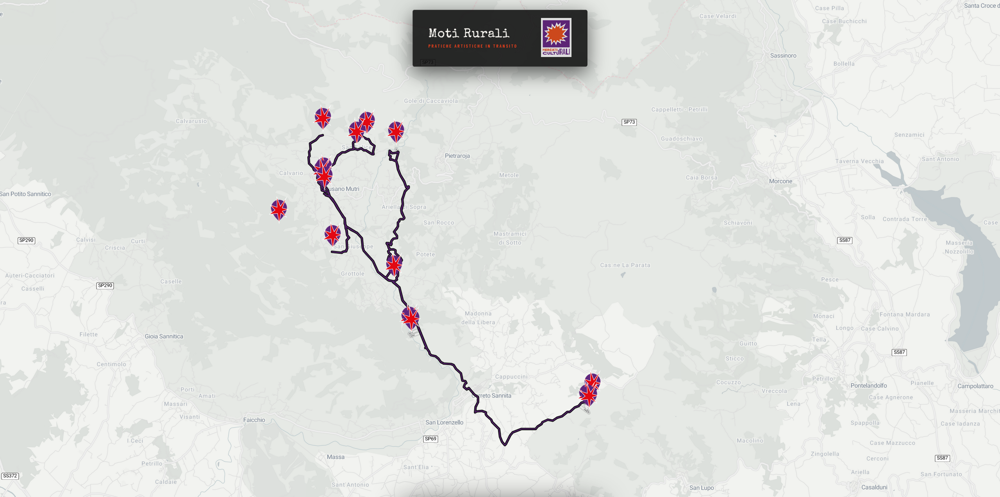
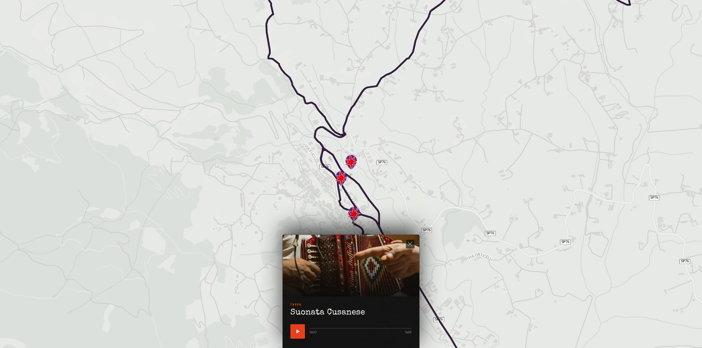

# Moti Rurali — Mappa Interattiva

An interactive web map built as an audiovisual installation for **Moti Rurali**, a site-specific artistic residency organized by [Mercati Culturali](https://www.arcibenevento.it/residenze-mercati-culturali/) in Cusano Mutri. An electronic music collective explored the territory on foot, collecting field recordings at specific locations; the map was projected live during the final performance as the accompanying visual layer for the resulting electronic suite.

> *"Pratiche Artistiche In Transito"* — art practices in transit.

---

## 🎯 Context & Purpose

The application was conceived for **live projection** during the performance restitution. Each marker on the map corresponds to a sound-collection station along the exploratory route. Audience members could see the territory materialize in real time as the music unfolded, with the panel opening to reveal the location name and triggering playback of the original field recording captured there.

The entire stack runs **fully offline** — no backend, no external API calls beyond map tiles — to ensure reliable operation in a live venue context.

---

## ✨ Features

* **Interactive Leaflet Map** centered on Cusano Mutri, with custom branded markers and constrained pan/zoom bounds
* **Animated Route Overlay** connecting all recording stations via Leaflet Routing Machine, styled with a double-stroke purple-on-black line
* **Slide-up Station Panel** triggered on marker click — displays location image, name, and a custom audio player
* **Custom Audio Player** with play/pause toggle, scrubable progress bar with animated thumb, and formatted time display
* **Fly-to Animation** on marker selection: the map smoothly flies to the selected station at an elevated zoom level
* **Panel State Management** with silent-close on consecutive clicks and full-close on map background click
* **Responsive Layout** with mobile-specific breakpoints for panel width, image height, and header sizing
* **Dark Editorial UI** built with CSS custom properties, `backdrop-filter` glass surfaces, and `Special Elite` / `Barlow Condensed` typography

### Map View
The main interface as projected during the live performance with custom markers distributed across the territory and the stylized routing line connecting each recording station.



### Station Panel
Clicking a marker triggers a fly-to animation, collapses the header, and slides up the station panel with the location photograph and field recording player.



---

## 🛠️ Tech Stack

| Layer | Technology |
|---|---|
| Map Engine | [Leaflet.js](https://leafletjs.com/) 1.9.4 |
| Routing | [Leaflet Routing Machine](https://www.liedman.net/leaflet-routing-machine/) 3.2.12 |
| Map Tiles | [Stadia Maps](https://stadiamaps.com/) — `alidade_smooth` |
| Styling | Vanilla CSS with custom properties |
| Scripting | Vanilla ES Modules (`type="module"`) |
| Fonts | Google Fonts — Special Elite, Barlow Condensed |
| Runtime | Fully static — no build step required |

## ⚙️ Configuration

All station data is defined in `constants/data.js` and exported as a `markers` array. Each entry follows this shape:

```js
{
  name: "Nome della Tappa",
  lat: 41.3024,
  lng: 14.4891,
  image: "./media/stations/tappa.jpg",
  audio: "./media/stations/tappa.mp3",
  excludeFromRouting: false  
}
```

The `center` and `bounds` exports in the same file control the initial map viewport and the enforced pan limits.

---

## 🚀 Running Locally

No build step or package manager required. Serve the project root with any static file server and 
then open `http://localhost:8080` in a browser. Opening `index.html` directly via `file://` will block ES module imports in most browsers, a local server is required.

---

## 🤝 Credits

Built in collaboration with **Mercati Culturali** for the *Moti Rurali* artistic residency, Cusano Mutri (BN), Campania, Italy.  
Field recordings and artistic direction by the resident electronic music collective **[No:Orchestra](https://www.instagram.com/no_orchestra_/)**.
